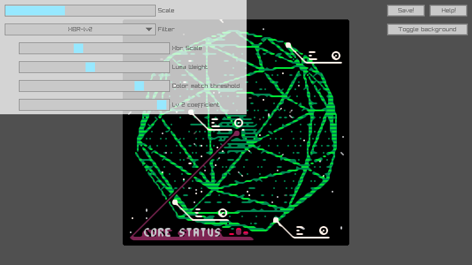

# Squint
## "Maybe if I squint, those pixels will look better"



Squint is a live upscaler companion program for [Aseprite][aseprite] that allows you to see live what your drawing would look like upscaled through one those filters:

- xBR-lv1-noblend (simpler, but less fancy)
- xBR-lv2 (fancier with extra smoothness and settings)

## Known Issues
- the xBR-lv2 doesn't compile on Intel HD GPU drivers yet. Please use another GPU driver until I fix that.

## Usage

### Aseprite setup
- Copy the `client.lua` script into your Aseprite `scripts` folder. You can locate it by clicking on "Locate Configuration File" at the bottom of the General section of Aseprite's preferences.
- Launch the script through ("File / scripts"). If you don't see it, you probably haven't reloaded Aseprite or rescanned the script folder yet right after dropping the file.
- A small window should appear. It's non-blocking, you can still edit your sprite while it's on.
- Aseprite is now waiting for squint to wait for a connection.
- You can now launch squint and see it showing your sprite once the communication is done.

### Controls
- F1 to toggle the help screen.
- F2 to toggle the background's color between white and dark gray.
- Right-click or TAB to toggle the options screen.
- S to save the current result into `saved.png`.
- F12 to screenshot.

## Compilation

Squint requires a compiler with C++17 and C11 support and [CMake][cmake].

It has a few dependencies: [raylib], [raygui] and [IXWebSocket][ixwebsocket].

### Tested setups
- Windows 10 x64 and Visual Studio 2019
- Archlinux x64 and GCC 11.1.0
    - The AUR's `aseprite` package doesn't build with websockets and scripting enabled. You might want to tweak the PKGBUILD to compile a version with those.

### Dependency handling
- Raylib will be downloaded automatically by CMake if it wasn't installed on your computer
- The other libraries will be fetched once you type `git submodules init --update` at the root of the repository.

### Compilation steps
- Install a compiler.
- Create a build folder inside the repo's root.
- Open a terminal there and press
```shell
    cmake build .. -DUSE_ZLIB=OFF
```
- CMake should create either a Makefile or a Visual Studio solution (or anything else if you precised it). Use your favorite IDE to use those to compile.
- If everything is alright, you should get a `squint` (or `squint.exe`) in the build folder.

[aseprite]: https://aseprite.org
[cmake]: https://cmake.org
[raylib]: https://raylib.com
[raygui]: https://github.com/raysan5/raygui
[ixwebsocket]: https://github.com/machinezone/IXWebSocket